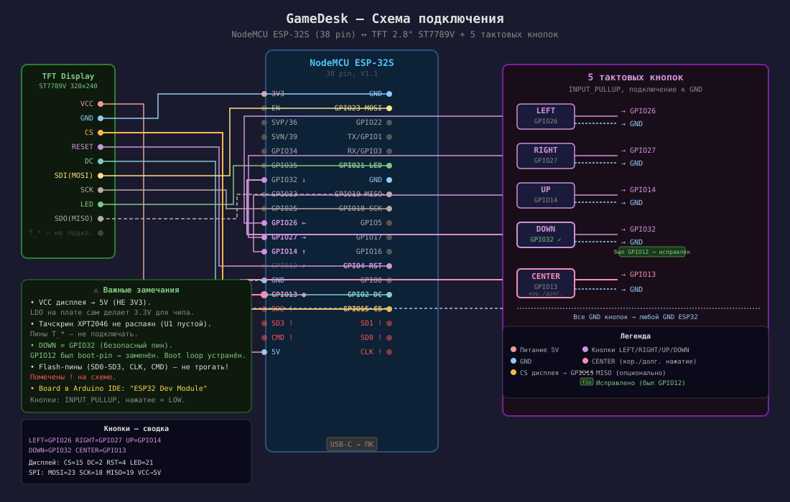

# 🎮 GameDesk

**GameDesk** — это настольное аппаратно-программное устройство, которое работает как внешний интерактивный дисплей для вашего ПК. Оно в реальном времени отображает запущенную игру, длительность игровой сессии, системные параметры ПК (температура CPU/GPU, использование RAM), а также ведет статистику вашего игрового времени.

---

## 🌟 Возможности

- **Мониторинг текущей игры:** Автоматически определяет запущенную игру и показывает время текущей сессии.
- **Системная телеметрия:** Отображение в реальном времени нагрузки и температуры (CPU, GPU, RAM).
- **Игровая статистика:** Подсчет общего времени в игре, времени за неделю и месяц, отслеживание последней даты запуска.
- **История игр (Recent Games):** Удобный список последних запущенных игр с быстрым доступом к детальной статистике.
- **Интерактивный UI:** Управление устройством с помощью 5 кнопок (навигация по кольцу, детальный просмотр, меню настроек).
- **Автономность при отключении ПК:** Автоматический переход в режим OFFLINE при потере связи и возврат при ее восстановлении.

---

## 🏗 Архитектура (Thin Client)

Проект построен на архитектуре «Тонкий клиент» (Thin Client) и состоит из двух частей:

1. **PC Core (GameDesk.exe / Python скрипты):** Вся бизнес-логика выполняется на компьютере. ПК отслеживает запущенные процессы, считает время сессий, собирает телеметрию (через LibreHardwareMonitor), ведет файл статистики (`games.json`) и отправляет готовые данные и команды по USB Serial.
2. **ESP32 (UI Устройство):** Микроконтроллер отвечает только за отображение интерфейса, обработку нажатий кнопок, переключение экранов и парсинг полученных пакетов по протоколу связи. Никаких сложных расчетов — только плавный UI!

---

## 🛠 Аппаратная часть

Для сборки проекта вам понадобятся:
- **Микроконтроллер:** NodeMCU ESP-32S (38 pin), чип ESP32-WROOM.
- **Дисплей:** TFT LCD 2.8" (Контроллер ST7789V, SPI, 320x240 пикселей).
- **Управление:** 5 обычных тактовых кнопок (momentary push).

### Схема подключения и распиновка

**Кнопки:**
Кнопки подключаются напрямую к пинам ESP32 одной ногой, а другой — к общей земле (GND). Внутренняя подтяжка `INPUT_PULLUP` включена программно, поэтому внешние резисторы не требуются!

| Кнопка | Пин ESP32 | Назначение |
|--------|-----------|------------|
| **LEFT** | GPIO 26 | Экран влево / Выход из статистики |
| **RIGHT** | GPIO 27 | Экран вправо |
| **UP** | GPIO 14 | Вверх / Скролл списка |
| **DOWN** | GPIO 32 | Вниз / Скролл списка |
| **CENTER** | GPIO 13 | Выбор (короткое нажатие) / Настройки (долгое нажатие) |

**Дисплей:**
Подключается по интерфейсу SPI. Плата дисплея обычно имеет собственный понижающий стабилизатор, поэтому VCC дисплея необходимо подключать к **5V (VIN)** пину ESP32.

#### 🔌 Визуальные схемы



---

## 💻 Программная часть и запуск

### 1. Настройка ESP32 (Прошивка)
Код для ESP32 находится в папке `GameDesk_ESP32`. Если вы настраиваете рабочее место с нуля, выполните следующие шаги:

1. **Установите драйвер USB-UART:**
   - Для того чтобы компьютер распознал плату ESP32 и в системе появился нужный COM-порт, распакуйте архив `CP210x_Universal_Windows_Driver.zip`, который находится в корне репозитория, и установите драйвер.
2. Установите [Arduino IDE](https://www.arduino.cc/en/software) (рекомендуется версия 2.x).
3. **Добавьте поддержку ESP32:**
   - В Arduino IDE откройте *Файл -> Настройки* (File -> Preferences).
   - В поле «Дополнительные ссылки для менеджера плат» (Additional Boards Manager URLs) вставьте ссылку:
     `https://raw.githubusercontent.com/espressif/arduino-esp32/gh-pages/package_esp32_index.json`
   - Перейдите в *Инструменты -> Плата -> Менеджер плат* (Tools -> Board -> Boards Manager), введите в поиске `esp32` и установите пакет от Espressif Systems.
4. **Установите библиотеку дисплея:**
   - Перейдите в *Скетч -> Подключить библиотеку -> Управлять библиотеками* (Sketch -> Include Library -> Manage Libraries).
   - Введите в поиске `TFT_eSPI` (автор Bodmer) и установите её.
5. **Настройте библиотеку дисплея:**
   - В корне этого репозитория лежит заранее подготовленный файл `User_Setup.h` с правильными пинами и настройками для ST7789V.
   - Скопируйте этот файл.
   - Перейдите в папку, куда Arduino скачивает библиотеки (обычно это `Документы/Arduino/libraries/TFT_eSPI/`).
   - Замените оригинальный файл `User_Setup.h` в этой папке на скопированный из репозитория.
6. **Прошивка:**
   - Откройте скетч `GameDesk_ESP32/GameDesk_ESP32.ino`.
   - В меню *Инструменты -> Плата* выберите `ESP32 Dev Module`.
   - Выберите правильный COM-порт, к которому подключена плата.
   - Нажмите кнопку «Загрузка» (Upload).

### 2. Настройка ПК (GameDesk PC Core)
Код серверной части для ПК находится в папке `gamedesk_pc`.
1. Убедитесь, что у вас установлен **Python 3.x**.
2. Перейдите в папку ПК клиента:
   ```bash
   cd gamedesk_pc
   ```
3. Установите зависимости:
   ```bash
   pip install -r requirements.txt
   ```
4. Для корректной работы телеметрии запустите LibreHardwareMonitor (если требуется) или убедитесь, что скрипт имеет соответствующие права.
5. Запустите основной скрипт (либо собранный `GameDesk.exe`, если он уже скомпилирован):
   ```bash
   python main.py
   ```
*(ПК автоматически найдет COM-порт с ESP32 и установит соединение! Хардкодить порт не нужно.)*

---

## 🕹 Управление интерфейсом

Интерфейс устройства разбит на несколько экранов (состояний): **HOME (GAME)**, **MONITOR**, **STATS**, **RECENT GAMES**.

- ⬅️ **LEFT / RIGHT** ➡️ — Циклическое переключение между главными экранами.
- ⬆️ **UP / DOWN** ⬇️ — Навигация по спискам (например, в Recent Games или Settings).
- 🔘 **CENTER (Короткое <0.5 сек)** — Контекстное действие (например, открыть детальную статистику по игре).
- 🔘 **CENTER (Долгое 1.5–2 сек)** — Вход или выход из глобального меню **SETTINGS** из любого экрана. (В меню Settings кнопки влево/вправо блокируются от случайных нажатий).

> 💡 **Отладочный режим (Debug Mode):** Если удерживать кнопку **CENTER** во время загрузочной анимации устройства, включится вывод отладочной информации по Serial порту на ПК.

---

## 📋 Статус проекта

Текущая версия проекта — **v1.0** (на основе спецификации ТЗ v2.1).
Базовый функционал полностью реализован: определение игр, телеметрия, переключение экранов, списки игр и меню настроек.

Подробный план развития и будущих обновлений (регулировка яркости, Wi-Fi и т.д.) доступен в файле [Roadmap](DOC/Roadmap.md) и [Техническом задании](DOC/Техническое_задание.md).

---
*Приятной игры и красивого мониторинга на вашем столе! 🚀*
